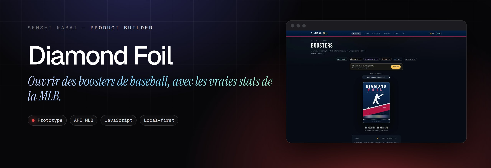
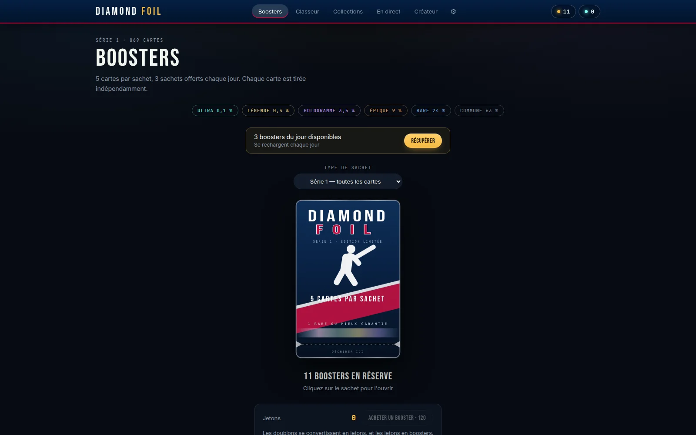

<p align="center"><a href="https://engob.github.io/DiamondLB/"></a></p>

<p align="center">
  <a href="https://engob.github.io/DiamondLB/"></a>
  <a href="https://www.senshicore.com/projets/diamond-foil/"></a>
</p>

<h1 align="center">Diamond Foil</h1>
<p align="center"><b>Ouvrir des boosters de baseball, avec les vraies stats de la MLB.</b><br>Un prototype de jeu de cartes à collectionner : boosters, classeur, créateur de cartes et scores en direct, alimenté par les données officielles de la MLB.</p>
<p align="center"><sub>Statut : <b>Prototype</b></sub></p>

---

### Le problème

Tester vite un concept de jeu de cartes crédible, sans inventer de données ni monter de serveur.

### L'idée

Tout vient de l'API publique de la MLB : effectifs, statistiques, légendes et scores du jour. Rien n'est écrit en dur.

### Comment c'est fait

Page statique sans dépendance ni compilation, requêtes espacées pour ménager l'API, cache de six heures, collection enregistrée localement.

**Outils** &nbsp; `API MLB` `JavaScript` `Local-first`

### Aperçu

<p align="center"> </p>

### Mentions

Prototype personnel et non commercial, **non affilié** à la MLB ni aux clubs. Données, noms, photos et logos restent la propriété de MLB Advanced Media et des clubs.

### English

**Diamond Foil** — *Open baseball booster packs, with real MLB stats.* A trading card game prototype: boosters, binder, card creator and live scores, powered by official MLB data.

Quickly test a credible card game concept without making up data or setting up a server. Everything comes from the public MLB API: rosters, stats, legends and today's scores. Nothing is hard-coded. A static page with no dependencies or build step, spaced-out requests to be gentle with the API, a six-hour cache, collection stored locally.

---

<p align="center"><sub>Conçu, développé et mis en ligne par <b>Senshi Kabai</b>, Product Builder · <a href="https://www.senshicore.com/">portfolio</a> · <a href="https://www.senshicore.com/projets/diamond-foil/">fiche du projet</a><br>© 2026 Senshi Kabai — tous droits réservés.</sub></p>


<details>
<summary><b>Documentation technique</b> · notes de développement et de mise en ligne</summary>

## Diamond Foil — prototype

Jeu de cartes à collectionner MLB. **Toutes les données viennent de l'API
officielle MLB. Rien n'est écrit en dur.**

Un dossier, aucune dépendance, aucun build, aucun service payant.

### Démarrer

Double-cliquez `index.html`, ou poussez le dossier sur GitHub Pages :

```bash
git init && git add . && git commit -m "Diamond Foil"
git branch -M main
git remote add origin https://github.com/VOUS/diamond-foil.git
git push -u origin main
```
Puis **Settings → Pages → Deploy from a branch → `main` / `/ (root)`**.

Au premier lancement, l'application va chercher les données auprès de la MLB
(une minute environ), puis les met en cache 6 heures.

### D'où viennent les données

| Source | Ce qu'elle fournit |
|---|---|
| `/api/v1/teams?sportId=1` | les 30 franchises |
| `/api/v1/teams/{id}/roster?rosterType=active` | l'effectif actif de chaque club |
| `/api/v1/people?personIds=…&hydrate=stats(...)` | fiches et statistiques réelles, par lots de 40 |
| `/api/v1/stats/leaders?…&statType=statsSingleSeason` | meilleures saisons de l'histoire → Légendes et Ultra |
| `/api/v1/stats/leaders?…&season=YYYY` | meneurs de la saison → marqueurs |
| `/api/v1/schedule?…&hydrate=team,linescore` | scores du jour, onglet **En direct** |

Une soixantaine de requêtes, faites une fois, en **série** — trente requêtes
simultanées sur une API publique gratuite, c'est le meilleur moyen de se faire
limiter.

### Rien n'est inventé

- **Les statistiques** sont celles de l'API, telles quelles.
- **Les marqueurs** (« Meneur CC », « Meneur MPM », « Recrue ») viennent des
  classements officiels et de la date de début en MLB — plus de seuils choisis
  arbitrairement.
- **Les légendes** sont le classement all-time des meilleures saisons ; les
  trois meilleures à l'OPS deviennent Ultra.
- **Un joueur sans apparition est écarté** plutôt que de recevoir des chiffres
  de remplissage. C'était la cause des anciennes « stats à zéro ».
- **Sans connexion, il n'y a pas de cartes** — pas de fausses cartes.

La **rareté** est la seule chose calculée, et ce n'est pas une invention : c'est
un classement de données réelles. La formule est visible dans `catalog.js` :

| Frappeurs (OPS) | Lanceurs (MPM, manches) | Rareté |
|---|---|---|
| ≥ 1.000 | ≤ 2.60 et ≥ 120 MJ | Hologramme |
| ≥ 0.900 | ≤ 3.20 | Épique |
| ≥ 0.780 | ≤ 3.90 | Rare |

Le classement se met donc à jour tout seul quand les statistiques changent.

### Notes en lettres — pour comprendre sans rien connaître au baseball

Un néophyte ne sait pas ce que vaut un OPS de .972. Tout le monde comprend
« A ». Chaque aptitude est donc notée **de F à S**, comme dans *Jikkyou
Powerful Pro Yakyuu* :

| Frappeurs | Mesure |
|---|---|
| Contact | proportion de coups sûrs |
| Puissance | coups de circuit |
| Production | coéquipiers ramenés au marbre |
| Complet | présence sur les buts + puissance |
| Vitesse | buts volés |

| Lanceurs | Mesure |
|---|---|
| Efficacité | points encaissés sur neuf manches |
| Domination | retraits sur trois prises |
| Précision | adversaires laissés sur les buts par manche |
| Endurance | manches lancées |
| Victoires | matchs gagnés |

Chaque ligne affiche la note, une jauge, **la valeur réelle d'où elle vient**
et une phrase d'explication. Ce n'est pas une donnée inventée : c'est une
conversion visible d'une mesure en note lisible, comme une note sur 20. Les
seuils sont dans `abilities()`, au même endroit.

### Visuels de sachet

Onglet **⚙ Réglages**. Chaque série peut avoir son propre visuel : cinq motifs
fournis (batteur, lanceur, gant, balle, terrain), ou **votre propre image**.
Les motifs sont en SVG — nets à toute taille, quelques kilo-octets, et la
couleur s'adapte à la collection. Une photo importée est réduite avant
stockage, sinon deux ou trois sachets saturent le quota du navigateur.

### Statistiques en français

Terminologie du baseball francophone. Survolez une statistique pour son
intitulé complet.

| Frappeurs | | Lanceurs | |
|---|---|---|---|
| MOY | moyenne au bâton | MPM | moyenne de points mérités |
| CC | coups de circuit | RB | retraits au bâton |
| PP | points produits | V-D | victoires-défaites |
| OPS | présence + puissance | MJ | manches lancées |

### Mécanique

| | |
|---|---|
| Booster | 5 cartes |
| Offre quotidienne | 3 boosters |
| Raretés | Commune 63 % · Rare 24 % · Épique 9 % · Hologramme 3,5 % · Légende 0,4 % · Ultra 0,1 % |
| Ultra | débloque un film, rejouable depuis le classeur |
| Doublons | convertibles en jetons (12 à 1800 selon la rareté) |
| Boutique | 120 jetons = 1 booster |
| Boosters thématiques | par franchise, division ou série |
| Collections | franchises, divisions, saisons, séries, **plus les vôtres** |

### Les cinq écrans

**Boosters** · ouverture avec déchirure, révélation carte par carte en grand,
sans minuteur — rien n'avance tant que vous ne cliquez pas.

**Classeur** · toutes les cartes, possédées ou non. Les verrouillées restent
lisibles : seule la photo est masquée.

**Collections** · progression et récompenses.

**En direct** · scores MLB du jour, manche en cours, coureurs sur les buts,
rafraîchis toutes les 30 secondes.

**Créateur** · zone privée verrouillable. Vos cartes, vos collections.

> Le code du créateur n'est pas un mot de passe : il vit dans `localStorage`,
> en clair. Il écarte un curieux, rien de plus.

### Le foil

Technique de `pokemon-cards-css` (simeydotme) : la teinte est pilotée par le
pointeur via `--h`, les couches se mélangent entre elles par
`background-blend-mode`, et un `radial-gradient farthest-corner` centré sur le
curseur module l'intensité. Les couleurs **changent** au mouvement au lieu de
glisser.

### Fichiers

| | |
|---|---|
| `index.html` | structure |
| `catalog.js` | construction du catalogue depuis l'API |
| `live.js` | scores en direct |
| `teams.js` | couleurs et stades des 30 franchises |
| `sets.js` | raretés, collections, récompenses |
| `card.css` | cadre, foil, terrain, marqueurs |
| `app.css` | navigation, vues, ouverture, lecteur |
| `app.js` | tirage, rendu, classeur, créateur |

`teams.js` est le seul fichier de données local : il contient les couleurs des
clubs, que l'API ne fournit pas. Tout le reste vient du réseau.

### Limites

Depuis un fichier local (`file://`), le navigateur peut bloquer les requêtes
(CORS). En ligne, sur GitHub Pages, elles passent. En production, ces appels
devraient transiter par votre serveur : l'API MLB n'offre aucun SLA.

Le « film » d'une carte Ultra est une mise en scène, pas une vraie vidéo :
brancher des archives demande hébergement et droits.

</details>
